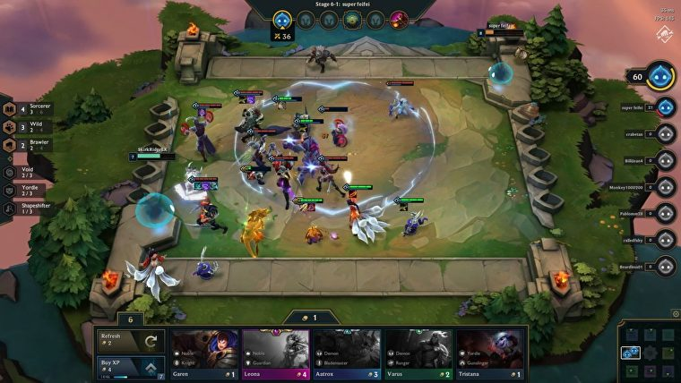

## Context

Riot games ha creat recentment un videojoc anomenat Teamfight Tactics (TFT), aquest està guanyant molta popularitat i sembla que seguirà augmentant.
El lloc triat "lolchess.gg" proporciona la informació necessària, ja que es dedica a ajudar als jugadors de diferents videojocs mostrant estadístiques. Aquest projecte pretén crear un scraper que sigui útil al llarg del temps. El TFT, com qualsevol altre videojoc online reb actualitzacions periòdicament i la idea és poder extreure nous datasets amb el mateix format, actualitzant els nous valors però mantinguen el format.

## Descripció

Aquest conjunt de dades ha estat generat com a pràctica de Tipologia i cicle de vida de les dades. El dataset compta amb informació sobre els diferents campions del videojoc Teamfigth tactics desenvolupat per Riot Games. En concret es pot trobar la informació de l'actualització 9.21. 

## Títol del dataset

El títol d'aquest dataset és **Teamfigth Tactics champions patch 9.21**. El nom està format per l'abreviatura del videojoc al que fa referència,  el contingut del joc que es tracta (els campions) i finalment el número que marca la versió del videojoc.

## Imatge descriptiva

\newpage

## Contingut 

Per a cada campió es poden trobar les següents característiques:

* **Name:** Nom del campió.

* **HealthLvl1:** Valor de salut del campió a nivell 1.

* **HealthLvl2:** Valor de salut del campió a nivell 2.

* **HealthLvl3:** Valor de salut del campió a nivell 1.

* **AttackDamageLvl1:** Valor de dany del campió a nivell 1.

* **AttackDamageLvl2:** Valor de dany del campió a nivell 2.

* **AttackDamageLvl3:** Valor de dany del campió a nivell 3.

* **DPSLvl1:** Valor de dany per segon del campió a nivell 1.

* **DPSLvl2:** Valor de dany per segon del campió a nivell 2.

* **DPSLvl3:** Valor de dany per segon del campió a nivell 3.

* **Range:** Rang d'atac del campió (1-4).

* **AttackSpeed:** Valor de la velocitat d'atac del campió.

* **Armor:** Valor de l'armadura del campió.

* **MagicalResistance:** Valor de la resistència màgica del campió.

* **Origin:** Origen o origens (separats per "-") del campió.

* **Class:** Classe del campió.

* **Cost:** Cost en monedes de cada peça del campió.

## Inspiració

Com a creador del dataset sóc jugador del TFT durant l'estiu vaig tenir la idea d'intentar crear un algorisme per tal d'avaluar composicions de campions, encara que l'algorisme es trobava en un avançat estat el vaig abandonar perquè no tenia una forma optima d'obtenir les dades que necessitava. Cursant l'assignatura de Tipologia i cicle de vida de les dades vaig tenir l'oportunitat i vaig decidir intentar-ho. Aquestes dades crec que poden ser útils pels jugadors professionals, ja que podran avaluar molts aspectes tècnics del videojoc, es poden fer estudis de balanceig, algorismes que ajudin a decidir la millor jugada, etc. Crec que pot tenir moltes possibilitats.  

## Agraïments
  
Les dades han estat extretes de la web [lolchess](https://lolchess.gg/). S'han utilitzat tècniques de web scraping a través de la llibreria *Beutiful Soup 4* de Python.
  
## Llicència

La llicència triada és la **CC BY-SA 4.0 License** aquesta comporta les seguents condicions:

* S'ha de proporcionar el nom del creador del conjunt de dades i indicar els canvis realitzats.

* Es permet us comercial.

* Les contribucaions realitzades a partir d'aquest treball hauran de tenir la mateixa llicència.

## Codi font i dataset

Tant el codi font com el dataset es poden trobar en el següent repositori https://github.com/nbustins/tftscraper.

